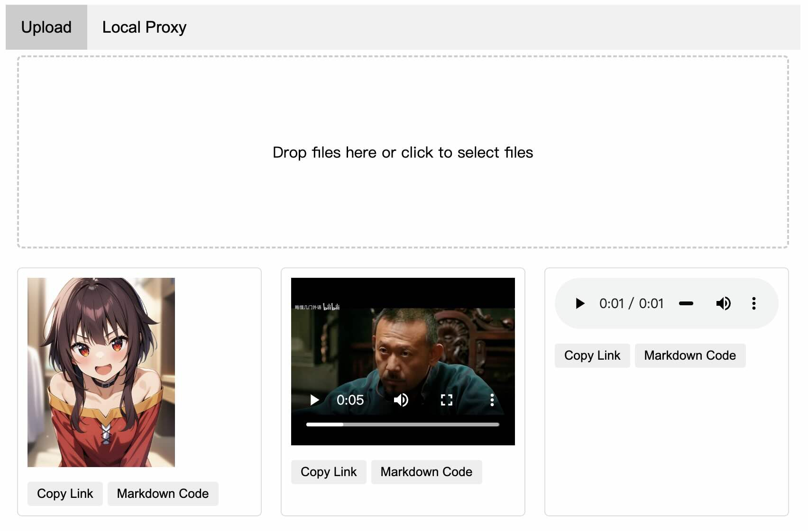

# Simple Image Hosting

[中文](#简单图床)

A simple private image hosting based on Python and Flask.

Supports uploading audio, video, and image files.

No file compression operation, no advanced features. Provides API access, page access, and simple authentication.

It is recommended to use frpc and other reverse proxy tools for HTTPS encryption and other operations.

## Features
- Upload audio, video, and image files
- No file compression operation
- Provides API access
- Provides page access
- Simple authentication

## Recommended Tools
It is recommended to use frpc and other reverse proxy tools for HTTPS encryption to ensure data transmission security.

## Page Preview
The page is as follows, providing "Copy Link" and "Copy Markdown" buttons after dragging and uploading files:

---

# 简单图床

一个基于 Python 和 Flask 的简单私人图床。

支持上传音频、视频、图片文件。

不会对文件进行压缩操作，没有高级功能。提供 API 访问、页面访问、简单身份验证。

建议配合 frpc 等反向代理工具进行 https 加密等操作使用。

## 功能简介
- 上传音频、视频、图片文件
- 不对文件进行压缩操作
- 提供 API 访问
- 提供页面访问
- 简单身份验证

## 推荐工具
建议使用 frpc 等反向代理工具进行 https 加密，确保数据传输的安全性。

## 页面预览
页面如下，拖拽上传文件后提供“复制链接”以及“复制 Markdown”按钮：

